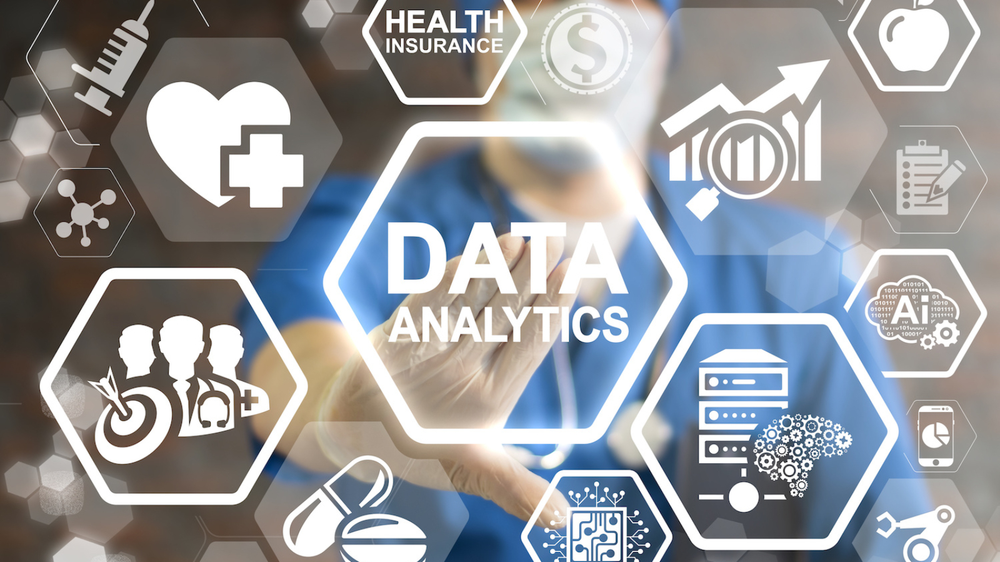

## project-4
# MediSmart Futures: Sharp Health Predictions

Welcome to our innovative health prediction project, ["MediSmart Futures: Sharp Health Predictions"]. We're dedicated to leveraging advanced technology and data analytics to forecast heart, liver, and diabetes conditions. Our mission is to empower individuals with early insights and personalized guidance for a healthier tomorrow.
Our goal is to develop and implement predictive models that enable early detection and proactive management of heart, liver, and diabetes conditions. We aim to provide individuals with accurate risk assessments, personalized health recommendations, and the knowledge they need to make informed decisions, ultimately improving their overall well-being and quality of life.

# Dashboard
Dashboard created using The visualisation is to include a Python Flask-powered API, HTML/CSS, Javascript and  database (SQL, MongoDB, SQLite)to configure some of the attributes of the application. From Application configuration objects store metadata for an application.

## Project Overview

The project's scope is to provide a valuable tool for General Practitioners (GPs) in Australia. It involves developing a comprehensive healthcare prediction system that assists GPs in early detection and severity assessment of heart, liver, and diabetes conditions. The system offers personalized health recommendations and facilitates referrals to specialists when required. The project aims to empower GPs with data-driven insights, aiding in more informed decision-making and enhancing patient care. By enabling GPs to catch conditions early and offer proactive management, the project can improve patient outcomes and reduce healthcare costs, ultimately benefiting both GPs and their patients.

# Requirements

1.	Load and Check Data
2.	Variable Description
3.	Basic Data Analysis
4.	Transforming the data
5.	Split and train 
6.	Visualization
7.	Modeling
8.	Conclusion

## File structure

   * Images: contains images of the plots and background for readme file.

    * Notebook: contains Ds_Store, diabetes_prediction.ipynb, heart_prediction.ipnyb,Liver_prediction.ipynb

    * Resources: Contains raw data, cleaned CSV data files and SQLite Database.

    * Templetes: style.css ,disease.html,health_info.html,home.html,insurance.html Interactive Dashboard files.

    * js:javascript

    * README.md: README file, you're already here!

# Tools
    Pandas
    Python
    Flask API
    SQLite
    Javascript
    HTML/CSS
    Tensflow
    Logistic regression
    keras for importing pickle
    json
    Neural networks

# Source of datasets: 

 https://www.kaggle.com/datasets/iammustafatz/diabetes-prediction-dataset

 https://www.kaggle.com/datasets/fedesoriano/heart-failure-prediction

 https://www.kaggle.com/datasets/abhi8923shriv/liver-disease-patient-dataset

# Html

# Javascript

•	We have done a full examination on a dataset related to diabetes, liver and heart
•	We have described the features of the dataset. 
•	We have done basic data analysis. 
•	We have detected the outliers with a function that we've coded ourselves and got rid of these outlier values for a better machine learning score.
•	We have visualized our data for better inspection and decision.
•	We have applied logical regression on our data and found out the best one for our dataset.
•	Machine learning is revolutionizing the field of medicine by enabling accurate diagnosis, personalized treatment, predictive analytics, and remote patient monitoring. The integration of machine learning algorithms with healthcare data has the potential to transform healthcare delivery, improving patient outcomes, reducing costs, and advancing medical research. As the field continues to evolve, it is imperative to address ethical considerations and data privacy concerns to harness the full potential of machine learning in medicine. With continued research and collaboration between healthcare professionals and data scientists, machine learning holds the promise of creating a future where healthcare is more precise, accessible, and effective for all.

# note: 

In  order to run the app.py without any errors for loading  the models we recommend the user to run the notebooks first in his/her python environment. This will save the models according to the users environment variables.

    

